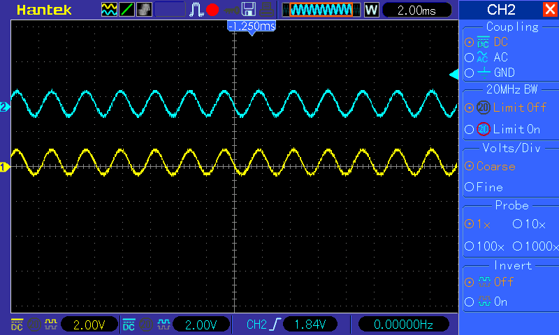
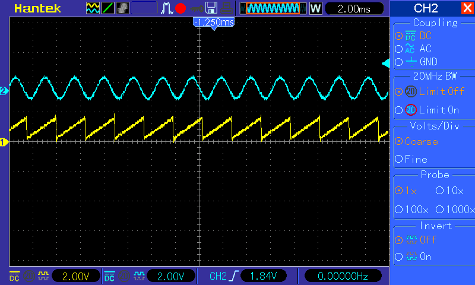

# ALSA-wave-generator

This generator works with 2 channels and S32 samples format.

## Params

```
./generator  <samplingRate> <waveL> <freqL> <phaseL> <volumeL> <waveR> <freqR> <phaseR> <volumeR>
```

### Descriptions

- `<samplingRate>`:
  - any integer value, which supports your audio card

- `<waveL>` and `<waveR>`
  - `sin`
  - `saw`

- `<freqL>` and `<freqR>`
  - float value in range 16-20000 for the frequency of the sound that can be heard, or another if it supports your audio card

- `<phaseL>` and `<phaseR>`
  - float value, which corresponding to the number of half-periods

- `<volumeL>` and `<volumeR>`
  - float value
  - this value will multiplicated by `1E+7`. Max value = `214`

## Example
    
```
./generator 44100 sin 440 0 50 saw 440 0 50
```
Two sin waves:



Two sinusoids in the opposite phase:


Sin and saw waves:


